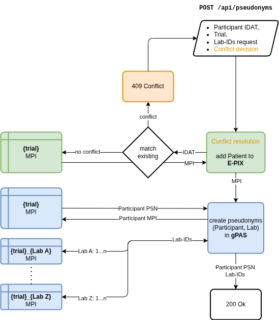

# 🛡️ ttp-idm

[](https://github.com/diz-unimr/ttp-idm/actions/workflows/mega-linter.yml)
[](https://github.com/diz-unimr/ttp-idm/actions/workflows/build.yaml)
[](https://github.com/diz-unimr/ttp-idm/actions/workflows/release.yaml)
[](https://codecov.io/gh/diz-unimr/ttp-idm)


> TTP Identity Management service

This service provides identity and pseudonym management with the Trusted third party (TTP) tools E-PIX and gPAS.

## API

An OpenApi spec is generated when building the service which can be obtained from `/api-docs/openapi.json` at runtime
or via the SwaggerUI (`/swagger-ui`) endpoint.

A copy of the current API doc is located at [/api-docs/openapi.json](/api-docs/openapi.json).
Inspect the API
at [swagger.io](https://petstore.swagger.io/?url=https://raw.githubusercontent.com/diz-unimr/ttp-idm/refs/heads/beta/api-docs/openapi.json).

### <code>POST</code> <code><b>/api/pseudonyms</b></code> <code>(create pseudonyms for participant)</code>



Adds participant to E-PIX and generate pseudonyms and ids for the provided `trial`.

The `lab` property determines the number of pseudonyms to be created for each individual laboratory by name.

> [!NOTE]
> Property _keys_ for these are dynamic.

#### Parameters

> None

#### Body

> | content-type       | data type   | required |
> |--------------------|-------------|----------|
> | `application/json` | `IdRequest` | true     |

#### Responses

> | http code                   | content-type               | response                    |
> |-----------------------------|----------------------------|-----------------------------|
> | `200` Ok                    | `application/json`         | `IdResponse`                |
> | `409` Conflict              | `application/json`         | `PromptResponse`            |
> | `404` Not Found             | `application/json`         | No matching duplicate found |
> | `500` Internal Server Error | `text/plain;charset=UTF-8` | Error message               |

### Example

#### Request

```json
{
  "idat": {
    "first_name": "Erika",
    "last_name": "Mustermann",
    "birth_name": "Musterfrau",
    "birth_date": "1975-08-22",
    "birth_place": "Musterstadt",
    "postal_code": "35037",
    "city": "Marburg"
  },
  "trial": "Studie",
  "lab": {
    "Labor 1": 2,
    "Labor 2": 4
  }
}
```

#### Response

```json
{
  "participant": "VYMGJ9TUMDHFPL14",
  "lab": {
    "Labor 2": [
      "0LTKNJNZC5ZEWHG0",
      "CXPEA1CP85JUKCVJ",
      "MFXLKP5Y4PPTKUZV",
      "3XPYZ932JCYAZ8TW"
    ],
    "Labor 1": [
      "CCRPJTW1R8WU6W3P",
      "1NFTHGWYNVYQEAPY"
    ]
  }
}
```

### <code>GET</code> <code><b>/api/pseudonyms/{trial}/{psn}</b></code> <code>(get pseudonyms for participant and trial)</code>

Get all pseudonyms for a participant by `trial` and `psn`.

#### Parameters

> None

#### Body

> None

#### Responses

> | http code                   | content-type               | response                    |
> |-----------------------------|----------------------------|-----------------------------|
> | `200` Ok                    | `application/json`         | `IdResponse`                |
> | `409` Conflict              | `application/json`         | `PromptResponse`            |
> | `404` Not Found             | `application/json`         | No matching duplicate found |
> | `500` Internal Server Error | `text/plain;charset=UTF-8` | Error message               |

### Example

#### Request

url: `/api/pseudonyms/Studie/VYMGJ9TUMDHFPL14`

#### Response

```json
{
  "participant": "VYMGJ9TUMDHFPL14",
  "lab": {
    "Labor 2": [
      "0LTKNJNZC5ZEWHG0",
      "CXPEA1CP85JUKCVJ",
      "MFXLKP5Y4PPTKUZV",
      "3XPYZ932JCYAZ8TW"
    ],
    "Labor 1": [
      "CCRPJTW1R8WU6W3P",
      "1NFTHGWYNVYQEAPY"
    ]
  }
}
```

## Configuration properties

Application properties are read from a properties file ([app.yaml](./app.yaml)) with default values.

| Name                          | Default           | Description                             | Required |
|-------------------------------|-------------------|-----------------------------------------|----------|
| `log_level`                   | info              | Log level (error,warn,info,debug,trace) |          |
| `ttp.epix.base_url`           |                   | E-PIX base url                          | ✓        |
| `ttp.epix.domain.name`        | test              | E-PIX MPI domain                        |          |
| `ttp.epix.domain.description` | Test domain       | E-PIX MPI domain description            |          |
| `ttp.epix.identifier_domain`  | MPI               | E-PIX MPI identifier domain             |          |
| `ttp.epix.data_source`        | dummy_safe_source | E-PIX id safe source                    |          |
| `ttp.gpas.base_url`           |                   | gPAS base url                           | ✓        |
| `ttp.timeout`                 | 120               | Retry timeout                           |          |

### Environment variables

Override configuration properties by providing environment variables with their respective property names. Replace `.`
with double underscore (`__`).

## Example deployment

Docker compose:

```yaml
query:
  image: ghcr.io/diz-unimr/ttp-idm:latest
  environment:
    LOG_LEVEL: debug
    TTP__EPIX__BASE_URL: http://localhost:8080
    TTP__EPIX__DOMAIN__NAME: trial
    TTP__GPAS__BASE_URL: http://localhost:8081
    TTP__TIMEOUT: 60
```

## License

[AGPL-3.0](https://www.gnu.org/licenses/agpl-3.0.en.html)
